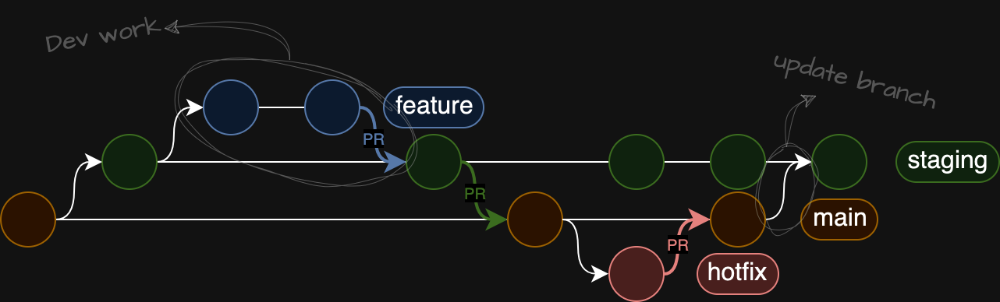

# loans @rte clients microservice

## repo variables
- `SOURCE_PATH`
- `TEST_UNITARY_PATH`
- `TEST_INTEGRATION_PATH`
- `DEV_REQUIREMENTS`
- `PROD_REQUIREMENTS`
- `PYTHON_VERSION`
- `UNITARY_COVERAGE`
- `PYLINT_SCORE`

## ToDo
- [ ] config requirements
- [ ] config Pylint
- [ ] config CI/CD
- [ ] test docker-compose

### Contributing, branchs definitions and pull requests
